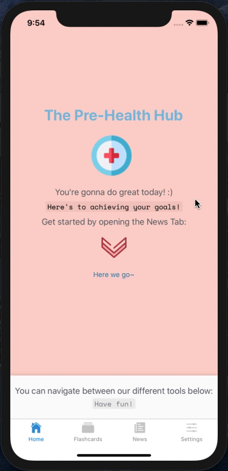

# The Pre-Health Hub
The Pre-Health Hub is an all-in-one productivity mobile app that boosts any pre-health professional's productivity.

## In Action



Deployment link coming soon!
<!-- <a href='https://financr.herokuapp.com/'>Heroku Deployment Link</a> -->

## Table of Contents

1. [UserStories](#userstories)
2. [Stack](#stack)
3. [GetStarted](#getstarted)
4. [Challenges](#challenges)
5. [Learnings](#learnings)
6. [Contributors](#contributors)

# UserStories

## Implemented:
- As a user, I want to be greeted at the home screen.
- As a user, I want to be able to see the current health-related news and stay up to date.
- As a user, I want to be able to navigate to the settings page.

## Coming Soon:
- As a user, I want to be able to use flashcards to help me study.
- As a user, I want to be able to log in and have my own custom settings.

# Stack

<table>
  <tr>
  </tr>
  <tr>
    <td align="center">Front-end</td>
    <td align="center">Back-end</td>
    <!-- <td align="center">Deployment</td> -->
  </tr>
  <tr>
    <td align="center"></td>
    <td align="center"></td>
    <!-- <td align="center"></td> -->
  </tr>
  <tr>
    <td align="center"></td>
    <td align="center"></td>
  </tr>
  <tr>
    <td align="center"></td>
    <td align="center"></td>
  </tr>
</table>

## Front-End
The Pre-Health Hub utilizes React Native on the front-end. Its navigation functionality was implemented using React Navigation.

## Back-End 
Users and associated data are stored in a MongoDB Atlas cluster. Express RESTful APIs are used to enter and retrieve data.

## Deployment
This section will be updated once the app has been deployed successfully.

# GetStarted
Take the following steps to run the app in your localhost, you will need to have the following:
- A MongoDB Atlas cluster must be set up, and the appropriate cluster URI and password must be added to the config.js file.

From terminal in the index folder:
```
yarn or npm install
yarn or npm start
npm run server
```

# Reflections

## Challenges
This project was focused on testing my ability to pick-up a new technology and implement a minimum viable product in 2 days. I decided to learn and implement React-Native to create an app that could potentially provide assistance to students who are studying in the highly competitive and challenging field of health-care.

## Learnings
React Navigation provides a very user-friendly interface for users, and allows highly modularized components when implementing the library. This can be paired with React Native Reanimated to provide fluid transitions and animations.

## Contributors
[Benjamin Hong](https://github.com/bhong35)